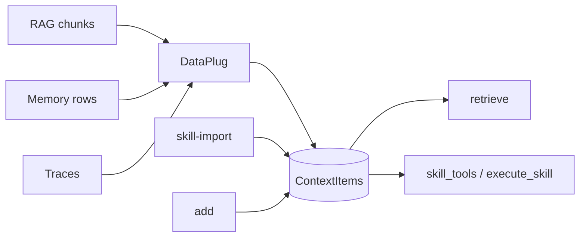

# DataPlugs (data sources)

A **DataPlug** ingests **external data sources** into ContextSeek through one API: `ContextSeek.plug()`. After import, every row is a `ContextItem`—use `retrieve()`, provenance, and `compact()` depending on stage and source type.

Built-in plugs (in `contextseek.plugs`):

| Data source type | Class | Typical `stage` | Primary read path |
|------------------|-------|-----------------|-------------------|
| RAG / retrieval | `RAGPlug` | `raw` → evolved | `retrieve()` |
| Memory | `PowerMemPlug` | `raw` → evolved | `retrieve()` |
| Execution trace | `TracePlug` | `raw` → evolved | `retrieve()` |
| Skill / tool definitions | `HermesSkillImporter`, `MCPToolImporter`, `OpenAIFunctionImporter` | `skill` | `skill_tools()` / `execute_skill()` |

| In scope | Out of scope |
|----------|--------------|
| RAG, memory, traces, skills (`contextseek.plugs`) | Agent framework bridges (`bridges/langchain`, `bridges/deepagents`) |
| — | Per-turn chat adapters in the harness |

Skill importers are implemented in `plugs/skills/` and re-exported from `contextseek.plugs`. See [Skill import](#skill-import-plugsskills).

Agent orchestration stays in your harness; import **documents, memories, traces, and skills** with plugs or `add()`.

---

## Protocol

```python
from collections.abc import Iterator
from contextseek.protocols.plugs import DataPlug, PlugMeta, RawEvent

class MyWikiPlug:
    def metadata(self) -> PlugMeta:
        return PlugMeta(
            name="wiki_deploy",
            source_type="document",
            description="Deploy wiki pages",
        )

    def stream(self) -> Iterator[RawEvent]:
        for page in crawl_wiki():
            yield RawEvent(
                content=page.text,
                source=f"wiki://{page.id}",
                tags=["wiki", "deploy"],
            )
```

| Type | Role |
|------|------|
| `PlugMeta` | `name`, `source_type` → `SourceType`, `description` |
| `RawEvent` | `content`, `source`, optional `tags`, `metadata` |

`stream()` must be **lazy**; the client calls `add()` per event.

---

## `plug()` behavior

```python
ctx.plug(source: DataPlug, *, scope: str | None = None)
```

Per event:

1. **Scope** = argument `scope`, else `event.metadata["scope"]`, else plug `name`
2. **Provenance** from `event.source` and `PlugMeta.source_type`
3. Optional **stage** / **stability** from `event.metadata`
4. Same **`add()`** pipeline as manual writes (summarizer, embedder, conflict check)

```python
from contextseek import ContextSeek
from contextseek.plugs import RAGPlug

ctx = ContextSeek.from_settings()
scope = "acme/kb/imports"

ctx.plug(rag_plug, scope=scope)
hits = ctx.retrieve("rollback procedure", scope=scope, k=10)
```

---

## RAGPlug — retrieval / knowledge chunks

Import chunks from any vector DB, search API, or RAG pipeline so they enter the evolution path (`raw` → `knowledge`) and accept `feedback()`.

```python
from contextseek.plugs import RAGPlug

docs = vectorstore.similarity_search("deployment checklist", k=10)
payload = [
    {
        "page_content": d.page_content,
        "metadata": d.metadata,
        "score": 0.87,
        "source": d.metadata.get("url", "faiss"),
    }
    for d in docs
]

ctx.plug(RAGPlug(documents=payload), scope="acme/rag/deploy")
```

| Input field | Mapping |
|-------------|---------|
| `content` or `page_content` | Body text |
| `metadata` | Copied into provenance context |
| `score` | `metadata.retrieval_score` |
| `source` | Provenance id (defaults to plug name) |

Default tags: `rag`, `retrieval`. Default `source_type`: `external_api`.

**Workflow:** RAG supplies candidates → agent uses some → `feedback(+)` on helpful ids → later `retrieve()` prefers them.

---

## PowerMemPlug — memory store

Import rows from [PowerMem](https://github.com/oceanbase/powermem) or any compatible memory API without replacing that system—ContextSeek becomes a unified recall layer on top.

### From live store

```python
from contextseek.plugs import PowerMemPlug

plug = PowerMemPlug.from_memory(
    memory,
    user_id="user-42",
    agent_id="support-bot",
    limit=500,
)
ctx.plug(plug, scope="acme/bot/user-42")
```

### From export / search results

```python
rows = memory.search("billing", user_id="user-42")
plug = PowerMemPlug.from_records(rows, source_prefix="powermem")
ctx.plug(plug, scope="acme/bot/user-42")
```

| Row field | Mapping |
|-----------|---------|
| `content` or `memory` | Text |
| `id` | `source=powermem://{id}` |
| `metadata`, `importance`, `score` | Preserved in metadata |

Examples: [examples/powermem_minimal.py](../../../../examples/powermem_minimal.py), [examples/powermem_plug_demo.py](../../../../examples/powermem_plug_demo.py).

Filter after import: `retrieve(..., filters={"tags": ["powermem"]})`.

---

## TracePlug — execution traces

Import **execution traces** (agent runs, tool loops, job logs) as structured `raw` items for extraction and evolution.

```python
from contextseek.plugs import TracePlug

ctx.plug(
    TracePlug(traces=[
        {
            "task_id": "deploy-42",
            "input": "Deploy service-x to production",
            "output": "Failed: readiness probe timeout",
            "tool_calls": [
                {"name": "kubectl_apply", "args": {"manifest": "prod.yaml"}, "result": "timeout"},
            ],
            "duration_ms": 183000,
            "status": "error",
            "tags": ["deploy", "prod"],
        },
    ]),
    scope="acme/ops/traces",
)
```

| Trace field | Stored in `content` |
|-------------|---------------------|
| `input`, `output` | Required strings |
| `tool_calls` | List (default `[]`) |
| `task_id` | Id + default `source=trace_import://{task_id}` |
| `feedback`, `duration_ms`, `status` | Optional |
| `tags` | Appended after `trace` |
| `source` | Override provenance id |
| `metadata` | Nested dict in content |

Default `source_type`: `trace_extraction`. Run `compact()` to promote insights to `extracted` / `knowledge` ([Evolution](../evolution.md)).

Single traces can also be written with `add(..., source_type=SourceType.trace_extraction)` when you do not need batch import.

---

## Skill import (`plugs/skills`)

Skill and tool definitions live at **`stage=skill`**. Same `plug()` API as RAG/memory/trace.

```bash
contextseek skill-import --scope acme/bot/skills --format hermes --path ~/.hermes/skills
contextseek skill-import --scope acme/bot/skills --format openai --path tools.json
contextseek skill-import --scope acme/bot/skills --format mcp --path mcp-tools.json
```

```python
from contextseek.plugs import HermesSkillImporter, MCPToolImporter

ctx.plug(HermesSkillImporter("~/.hermes/skills"), scope="acme/bot/skills")
```

(`contextseek.plugs.skills` works the same if you prefer the subpackage path.)

| Importer | Formats |
|----------|---------|
| `HermesSkillImporter` | `SKILL.md` / `*.skill.md` trees |
| `OpenAIFunctionImporter` | OpenAI function / tool JSON |
| `MCPToolImporter` | MCP `tools/list` payloads |

After import: **`skill_tools()`**, **`skill_context()`**, **`execute_skill()`** ([MCP, HTTP & CLI](mcp-http-cli.md)). Skills can also come from evolution (`distill` → `stage=skill`).

LangChain tool objects are not shipped as importers; register tools via OpenAI JSON or MCP export, or use **bridges** for runtime wiring.

---

## Mixing sources in one scope



```python
ctx.add("Official SLA: 4h", scope=scope, source="wiki/sla", tags=["kb"])
ctx.plug(PowerMemPlug.from_records(mem_rows), scope=scope)
ctx.plug(RAGPlug(documents=chunks), scope=scope)
# skills: CLI skill-import or HermesSkillImporter from contextseek.plugs

ctx.retrieve("SLA and billing preference", scope=scope, k=15)
ctx.skill_tools(scope=scope, query="deploy checklist")
```

Use **tags** or **`stage`** in `filters` when you need source-specific slices.

---

## Custom plug checklist

1. Pick the right `source_type` in `PlugMeta` (`document`, `trace_extraction`, `external_api`, …).
2. Use stable `event.source` ids (URLs, primary keys, trace ids).
3. Pass explicit `scope=` to `plug()` for production imports.
4. Run `overview(scope)` after large batches.

---

## Troubleshooting

| Issue | Fix |
|-------|-----|
| Empty after plug | Wrong `scope`; verify with `items(scope)` |
| `ValueError` duplicate | Identical content hash already exists |
| Skipped rows | Empty `content` / `memory` / trace `input`+`output` |
| All `raw` stage | Expected; run `compact()` |

## Related

- [Write & retrieve](../write-and-retrieve.md)
- [Core concepts](../core-concepts.md)
- [MCP, HTTP & CLI](mcp-http-cli.md)
