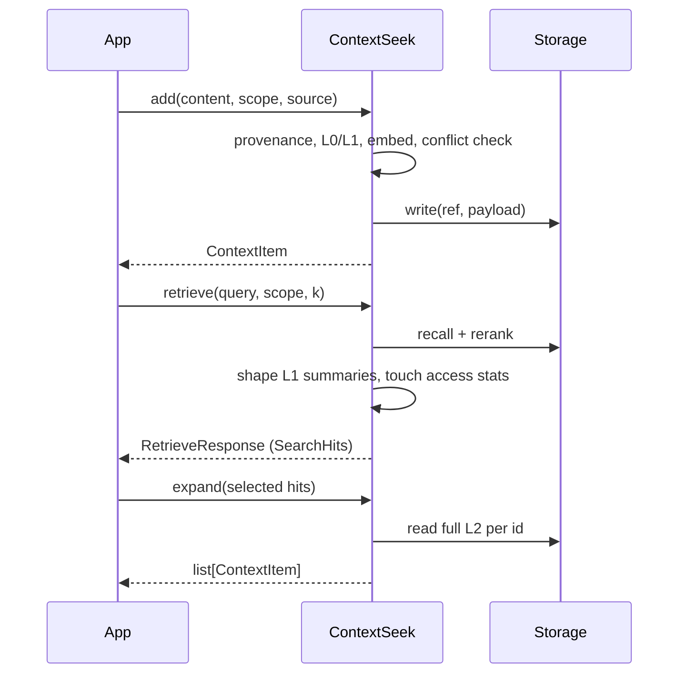

# Write & retrieve

This guide is the practical companion to [Core concepts](core-concepts.md). It walks through every parameter, the retrieval pipeline, response shapes, and patterns that work well in production agents.

## Overview

| Operation | Method | Returns | Typical use |
|-----------|--------|---------|-------------|
| Write | `add()` | `ContextItem` | Ingest user text, docs, traces, tool output |
| Ranked read | `retrieve()` | `RetrieveResponse` | Inject context into the next model turn |
| L2 upgrade | `expand()` | `list[ContextItem]` | Load full bodies for selected hits |
| L2 by id | `expand_by_ids()` | `list[ContextItem]` | HTTP/MCP bridges without `SearchHit` objects |
| Enumerate | `items()` | `list[ContextItem]` | Admin, evolution, debugging (not ranked) |
| Agent tools | `tools()` | `list[ToolSpec]` | OpenAI / Anthropic function definitions |



---

## Writing with `add()`

### Basic write

```python
from contextseek import ContextSeek
from contextseek.domain.provenance import SourceType
from contextseek.domain.stages import Stage

ctx = ContextSeek.from_settings()

item = ctx.add(
    "Rollback requires draining connections before schema migration.",
    scope="acme/payments/on-call",
    source="runbook/rollback-v4",
    source_type=SourceType.document,
    tags=["rollback", "mysql", "prod"],
)
print(item.id, item.stage, item.provenance.confidence)
```

### Parameters

| Parameter | Required | Default | Description |
|-----------|----------|---------|-------------|
| `content` | yes | — | `str` or `dict` (structured trace/JSON). Serialized for storage and search. |
| `scope` | yes | — | Isolation path, e.g. `tenant/project/user-id`. |
| `source` | yes | — | Stable source id: URL, trace id, file path, API name. |
| `source_type` | no | `human_input` | How data entered; drives default confidence and stage inference. |
| `tags` | no | `[]` | All-tags-must-match filter in `retrieve()`. |
| `confidence` | no | from `source_type` | Override provenance confidence `0.0`–`1.0`. |
| `stage` | no | inferred | Force `raw` / `extracted` / `knowledge` / `skill`. |
| `stability` | no | from stage | `ephemeral` / `transient` / `stable` / `permanent`. |
| `links` | no | `[]` | `Link` edges to other item ids (see [Core concepts](core-concepts.md)). |
| `check_conflicts` | no | `True` | Duplicate/contradiction detection on write. |

### Structured content

Traces and tool payloads are often JSON-like dicts:

```python
trace = ctx.add(
    {
        "input": "deploy service-x to prod",
        "tool_calls": [{"name": "kubectl", "result": "timeout"}],
        "output": "deployment failed: readiness probe",
    },
    scope="acme/platform/bot-7",
    source="session-trace-9f2a",
    source_type=SourceType.trace_extraction,
    tags=["deploy", "failure"],
)
```

Use `item.content_text` when you need a string (indexing, display). The object is stored as structured data when `content` is a dict.

### What happens inside `add()`

Understanding the pipeline helps debug “why is search slow” or “why no summary”:

1. **Policy** — Optional write ACL/redaction (`SECURITY_*` settings).
2. **Provenance** — Built from `source` + `source_type` (+ optional `confidence`).
3. **Stage / stability** — Heuristic inference, or LLM classifier when `EVOLUTION_LLM_STAGE_INFER_ENABLED=true`.
4. **Conflict check** — Exact duplicates raise `ValueError`. Near-duplicates get tag `near_duplicate`; contradictions get `has_contradiction` and `refuted_by` links.
5. **Summarizer** — If configured (`SUMMARIZER_PROVIDER=llm` + working `LLM_*`), generates `abstract` (L0) and `summary` (L1).
6. **Embedder** — If configured, embeds L0 abstract (falls back to full L2 text).
7. **Persist** — Serialized to storage under `contextseek://{scope}/{id}`.

Without summarizer + embedder, items are still searchable via **phrase/term** recall on backends that support substring search (e.g. FileBackend).

### Duplicate and conflict behavior

```python
# Second identical write in the same scope raises:
# ValueError: exact duplicate exists: <existing_item_id>
```

Set `check_conflicts=False` only when you intentionally allow noisy re-ingest (e.g. idempotent replays). Contradictions are **not** blocked by default; they are tagged and linked so retrieval and `evidence_chain()` can surface tension.

---

## Reading with `retrieve()`

### Basic search

```python
response = ctx.retrieve(
    "rollback procedure",
    scope="acme/payments/on-call",
    k=10,
)

print(response.meta.layer)   # "summary" or "full"
print(response.meta.hint)    # expand guidance for agents (when layer is summary)

for hit in response:
    print(hit.score, hit.layer, hit.recall_path)
    print(hit.provenance_summary)
    print(hit.item.id, hit.item.stage.value)
    print(hit.item.summary or hit.item.content_text)
```

`RetrieveResponse` is iterable: `for hit in response` ≡ `for hit in response.items`.

### Parameters

| Parameter | Default | Description |
|-----------|---------|-------------|
| `query` | (required) | Natural language or keyword string passed to recall routes. |
| `scope` | (required) | Scope prefix; storage lists refs under this prefix. |
| `k` | `10` | Max hits after rerank (also capped by internal candidate pool). |
| `full` | `False` | If `True`, return L2 in `hit.item.content` and set `layer="full"`. |
| `stage` | `None` | Filter to one `Stage`. |
| `tags` | `None` | Item must contain **all** listed tags. |
| `filters` | `None` | Dict: `stage`, `tags`, `min_confidence` (merged with explicit args). |
| `include_deleted` | `False` | Include soft-deleted items. |

### Filters bag

Explicit args and `filters` can be combined; explicit `stage` / `tags` win when both are set:

```python
response = ctx.retrieve(
    "database",
    scope="acme/db/eng",
    k=20,
    filters={
        "stage": "knowledge",
        "tags": ["mysql"],
        "min_confidence": 0.7,
    },
)
```

### Retrieval pipeline (under the hood)

For each `retrieve()` call:

1. **Prefix resolve** — `scope` → storage prefix (e.g. `contextseek://acme/payments/on-call/`).
2. **Recall** — One or more routes from `RETRIEVAL_RECALL_ROUTES`:
   - `phrase` — whole query string
   - `terms` — tokenized terms (supports CJK word chars)
   - `vector` — embedding similarity (needs embedder + vector-capable backend)
3. **Merge & dedupe** — Candidates from all routes merged by item id.
4. **Rerank** — `heuristic` (default) or `llm` when `RETRIEVAL_RERANKER_MODE=llm`.
5. **Policy filter** — Read ACL; drop denied hits.
6. **Shape** — Unless `full=True`, strip L2 from hits that have L1 `summary` and set `layer="summary"`.
7. **Access tracking** — Matched items get `touch()` (increments `access_count`).

**File backend note:** recall is substring-based. Prefer short, distinctive query terms (`"rollback"`, `"向量"`) rather than long conversational sentences.

### `SearchHit` fields

| Field | Meaning |
|-------|---------|
| `item` | `ContextItem` — `summary` for L1 hits; `content` filled when `full=True` or after `expand`. |
| `score` | Combined relevance after rerank (higher = better). |
| `layer` | `"summary"` or `"full"` for this row. |
| `provenance_summary` | One-line human-readable source blurb. |
| `stage_confidence` | Trust prior from stage (skill=1.0 … raw=0.3). |
| `recall_path` | Which route(s) found this item (debugging). |

### `ResponseMeta`

| Field | Meaning |
|-------|---------|
| `layer` | Response-wide tier: `"summary"` only if **every** hit is summary-shaped. |
| `full_via` | Always `"expand"` — programmatic hint for clients. |
| `hint` | Natural-language nudge for LLMs to call `expand` when summaries are insufficient. |

When `summarizer` is disabled and `full=False`, you may get L2-only hits, `layer="full"`, and a **one-time** `warnings.warn` suggesting summarizer configuration.

---

## `full=True` vs `expand()`

| Approach | Token cost | When to use |
|----------|------------|-------------|
| Default `retrieve()` | Low — L1 only | Most agent turns; let the model pick ids to deepen |
| `retrieve(..., full=True)` | High — all top‑k L2 bodies | Small `k`, always need full text |
| `retrieve()` + `expand(subset)` | Medium — pay only for chosen ids | **Recommended** for agents |

```python
response = ctx.retrieve("incident playbook", scope="acme/sre/team", k=15)

# Agent (or code) selects high-score rows
candidates = [h for h in response if h.score >= 0.55][:3]
full_items = ctx.expand(candidates)

for item in full_items:
    print(item.content_text)  # full L2
```

`expand()` reads storage using `hit.item.scope` and `hit.item.id` — you do **not** pass `scope` again.

### `expand_by_ids()`

For HTTP handlers or MCP tools that only receive string ids:

```python
full_items = ctx.expand_by_ids(
    ["abc123", "def456"],
    scope="acme/sre/team",
)
```

Behavior matches `expand()` but skips `SearchHit` wrappers.

---

## `items()` vs `retrieve()`

| | `items(scope, stage=…)` | `retrieve(query, scope, k=…)` |
|--|---------------------------|--------------------------------|
| Ordering | `created_at` ascending | Relevance score descending |
| Query | None — full prefix listing | Required |
| Use case | Compaction, audits, “list all knowledge” | Prompt injection, RAG |

```python
all_knowledge = ctx.items(scope="acme/sre/team", stage=Stage.knowledge)
print(f"{len(all_knowledge)} knowledge items")
```

Do not use `items()` to build prompts at scale; use `retrieve()` with a focused query.

---

## Exposing capabilities to LLMs: `tools()`

ContextSeek ships two tool specs aligned with `ResponseMeta.hint`:

```python
for spec in ctx.tools():
    openai_tool = spec.to_openai()
    anthropic_tool = spec.to_anthropic()
```

| Tool name | Purpose |
|-----------|---------|
| `retrieve` | `query`, `scope`, optional `k`, `full` |
| `expand` | `ids`, `scope` → L2 bodies |

Typical agent loop:

1. Model calls `retrieve` with user question → gets summaries + ids in hit metadata (your adapter should pass ids back).
2. Model calls `expand` for 1–3 ids that need detail.
3. Model answers using expanded content.

Register tools in your agent framework and map tool calls to `ctx.retrieve` / `ctx.expand_by_ids`.

---

## End-to-end example: support bot turn

```python
from contextseek import ContextSeek

ctx = ContextSeek.from_settings()
scope = "acme/support/user-8812"

# 1. Ingest ticket + KB snippet (could also come from a DataPlug)
ctx.add(
    "User tier: enterprise; SLA 4h.",
    scope=scope,
    source="crm/profile",
    tags=["profile"],
)
ctx.add(
    "Error E4021: payment gateway timeout after 30s. Retry with idempotency key.",
    scope=scope,
    source="kb/payments",
    tags=["kb", "payments"],
)

# 2. Retrieve for the current question
user_question = "Why did checkout timeout?"
response = ctx.retrieve(user_question, scope=scope, k=8)

context_lines = []
expand_ids = []
for hit in response:
    line = hit.item.summary or hit.item.content_text[:300]
    context_lines.append(f"- [{hit.score:.2f}] {line}")
    if hit.score > 0.5:
        expand_ids.append(hit.item.id)

# 3. Expand top evidence
if expand_ids:
    full = ctx.expand_by_ids(expand_ids[:2], scope=scope)
    for item in full:
        context_lines.append(f"\n[Full] {item.content_text[:1500]}")

system_prompt = "Relevant context:\n" + "\n".join(context_lines)
# ... call your LLM with system_prompt + user_question
```

---

## Operational tips

### Tuning recall

```env
# Keyword + semantic hybrid (needs embedder + vector backend)
RETRIEVAL_RECALL_ROUTES=["phrase","terms","vector"]
RETRIEVAL_RERANKER_MODE=llm
RETRIEVAL_LLM_RERANK_TOP_N=20
```

Start with `["phrase","terms"]` on FileBackend; add `vector` when OceanBase or another vector store is wired.

### Scopes

- One scope per **end-user + agent product** boundary is a good default.
- Shared team knowledge: use a team scope (`acme/platform/on-call`), not per-user duplication.
- Cross-scope search is not built in — call `retrieve()` per scope or ingest shared items into each scope via plugs.

### Feedback loop

After a successful answer, reinforce sources:

```python
ref = ctx.resolver.ref_for(scope, hit.item.id)
ctx.feedback(ref, scope=scope, score=0.3, reason="used in resolution")
```

Positive feedback increases `relevance_boost` and affects heuristic reranking.

### Debugging empty results

1. Confirm items exist: `ctx.items(scope=scope)`.
2. Try shorter queries matching **substrings** in `content` (FileBackend).
3. Check tags filter — all tags must match.
4. Verify `stage` filter is not too narrow.
5. Inspect `hit.recall_path` on any partial hits.

---

## Related docs

- [Configuration](../getting-started/configuration.md) — storage, embedding, summarizer, retrieval env vars
- [Core concepts](core-concepts.md) — Stage, L0/L1/L2, provenance
- [Provenance & audit](provenance-and-audit.md) — evidence chains
- [Storage](storage.md) — backend capabilities
