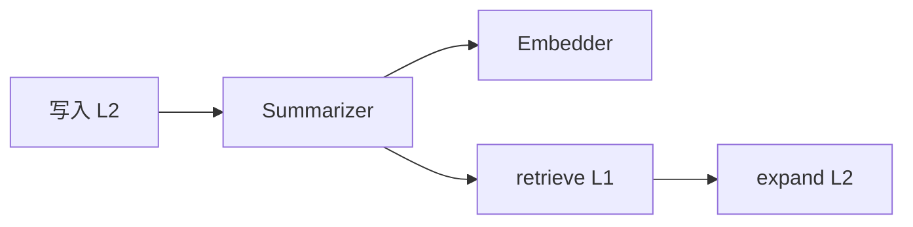

# 核心概念

ContextSeek 是面向 Agent 的**上下文资产层**：统一写入（`add`）、统一排名检索（`retrieve`），并可选地将原始观测演进为可复用技能。

概念文档已拆分为三个聚焦页面：

| 页面 | 内容 |
|------|------|
| [ContextItem 对象模型](../concepts/context-model.md) | 字段、Provenance、Link、统一设计理由 |
| [Scope 与 Stage](../concepts/scope-and-stage.md) | 隔离边界、成熟度流水线、Stability |
| [检索模型](../concepts/retrieval-model.md) | L0/L1/L2 分层、召回路由、重排、过滤 |

本页其余内容为快速概览，方便在一处查阅核心要点。

---

---

## 设计目标：一种对象，三重保障

进入 ContextSeek 的数据应满足：

| 保障 | 要回答的问题 | 机制 |
|------|--------------|------|
| **可检索** | 以后能在正确的租户/用户下找到吗？ | 写入即索引；`retrieve()` 召回+重排 |
| **可溯源** | 能解释 Agent 为何看到这条吗？ | 必填 `provenance`；`links`；审计 API |
| **可演进** | 经验能否随时间沉淀？ | `stage` 流水线；`compact()` / `dream()` |

无明确来源、永不被搜索、或纯临时缓冲的数据，应放在 ContextSeek 之外（如 Redis 会话缓存、原始日志文件）。

---

## ContextItem：唯一核心类型

记忆片段、知识库段落、Trace、蒸馏技能在类型上都是 **`ContextItem`**，靠 **stage**、**provenance**、**tags** 区分语义。

```python
from contextseek import ContextSeek
from contextseek.domain.provenance import SourceType
from contextseek.domain.stages import Stage, Stability

ctx = ContextSeek.from_settings()

item = ctx.add(
    "生产发布前必须跑集成测试。",
    scope="acme/platform/team-sre",
    source="runbook/deploy-v4",
    source_type=SourceType.document,
    tags=["deploy", "prod"],
    stage=Stage.knowledge,
    stability=Stability.stable,
)
```

### 字段分组

**身份**

| 字段 | 说明 |
|------|------|
| `id` | 自动生成的 hex id |
| `scope` | 租户/项目/主体路径 |
| `content` | L2：字符串或可 JSON 序列化的 dict |

**可检索**

| 字段 | 说明 |
|------|------|
| `abstract` | L0（约 100 字）— 向量输入 |
| `summary` | L1（约 2k 字）— `retrieve()` 默认展示 |
| `tags` | 过滤；`retrieve` 时须**同时包含**所列 tag |
| `embedding` | L0（无则 L2）的向量 |
| `searchable` | 归档/软删后为 False |
| `relevance_boost` | `feedback()` 正向强化后的加权 |

**可溯源**

| 字段 | 说明 |
|------|------|
| `provenance` | 必填来源信息 |
| `links` | 指向其他 item 的关系边 |

**可演进**

| 字段 | 说明 |
|------|------|
| `stage` | `raw` → `extracted` → `knowledge` → `skill` |
| `stability` | 保留/衰减策略 |

**生命周期（多由系统维护）**

| 字段 | 说明 |
|------|------|
| `created_at` / `updated_at` | UTC 时间 |
| `access_count` / `last_accessed_at` | 出现在 `retrieve()` 结果中时更新 |
| `superseded_by` | 替代本条的新 item id |
| `deleted_at` / `deleted_reason` | 软删除 |

字符串正文用 `item.content_text`；仅返回摘要时 `content` 可能为 `None`。

---

## Scope：隔离边界

Scope 是**路径字符串**：

```
{tenant}/{project}/{subject}
```

| 示例 | 含义 |
|------|------|
| `acme/checkout/user-42` | 某用户的 Agent 记忆 |
| `acme/platform/on-call` | 平台值班共享知识 |
| `demo_tenant/default/alice` | 教程数据 |

### 实践建议

- 最后一段用**稳定 id**（`user-42`），不用易变的显示名。
- **共享**知识放团队 scope，避免复制到每个用户 scope。
- `retrieve(scope=...)` 只搜该前缀；无内置「全租户搜索」— 多 scope 多次检索或通过 [DataPlug](integrations/dataplugs.md) 汇聚。

### 反模式

| 避免 | 原因 |
|------|------|
| 每条消息新建 `session-{uuid}` scope | 无法沉淀，存储爆炸 |
| 在 scope 里放密钥 | scope 会进日志与审计 |
| 无关产品共用一个 scope | 检索噪声与策略风险 |

---

## Stage 与 Stability

### 阶段流水线

```
raw  →  extracted  →  knowledge  →  skill
```

| Stage | 典型内容 | 命中时默认 stage 权重 |
|-------|----------|-------------------------|
| `raw` | 对话、工具 JSON、新 Trace | 0.3 |
| `extracted` | 提炼洞察 | 0.6 |
| `knowledge` | 合并后事实、runbook | 0.85 |
| `skill` | 可执行 playbook | 1.0 |

写入时未指定 `stage` 则启发式推断；`EVOLUTION_LLM_STAGE_INFER_ENABLED=true` 时可用 LLM 分类。

`compact()` 推动阶段迁移；`dream()` 在闲时做跨簇假设。详见 [上下文演进](evolution.md)。

### Stability

| 值 | 含义 |
|----|------|
| `ephemeral` | 随任务结束 |
| `transient` | raw/extracted 默认，正常衰减 |
| `stable` | 长期知识 |
| `permanent` | 技能/关键策略，仅手动删除 |

---

## L0 / L1 / L2：按 token 分层

| 层 | 字段 | Agent 默认可见？ | 何时生成 |
|----|------|------------------|----------|
| L0 | `abstract` | 否（内部） | `add()` 时 summarizer |
| L1 | `summary` | 是 | 同上 |
| L2 | `content` | `full=True` 或 `expand()` 后 | 你的写入内容 |



无 summarizer 时：无 L1、`retrieve` 直接给 L2，并**一次性警告** — 便于无 Key 开发；生产建议开启 `SUMMARIZER_PROVIDER=llm`。

---

## Provenance

| `source_type` | 约略默认置信度 | 适用 |
|---------------|----------------|------|
| `human_input` | 1.0 | 用户/运营录入 |
| `document` | 0.8 | 文档、工单 |
| `trace_extraction` | 0.5 | Trace 提炼 |
| `agent_inference` | 0.6 | 模型归纳 |
| `external_api` | 0.5 | 工具/API |
| `merge_result` | 0.7 | 合并产出 |
| `distillation` | 0.7 | 蒸馏 |
| `dream_*` | 0.3–0.4 | Dream 引擎 |

常用 provenance 字段：`source_id`、`confidence`、`verified`、`context`。

**硬约束：** 无 provenance 不得入库；`add()` 会自动构建。

---

## Link 与证据链

| `LinkType` | 作用 |
|------------|------|
| `derived_from` | 从另一条提炼 |
| `supported_by` | 佐证 |
| `refuted_by` | 反驳（冲突检测也会建） |
| `supersedes` | 替代旧版 |
| `merged_from` | 合并来源 |
| `distilled_into` | 指向 skill |
| `related_to` / `requires` / `synthesized_from` | 关联 / 依赖 / Dream 合成 |

API：`upstream()`、`evidence_chain()`、`chain_confidence()` — 见 [溯源与审计](provenance-and-audit.md)。

---

## 为何不用八种「记忆类型」？

许多系统将 profile、会话、知识库、Trace、技能分成不同表和 API。ContextSeek 统一为一种对象，因为：

1. 写入时不应让用户猜类型；
2. 同一段文字会从 `raw` 演进为 `knowledge`；
3. 检索、审计、删除策略一致。

用 **`source_type`、`tags`、`stage`** 表达意图即可。

---

## 结构示意

```
 应用 / Agent          ContextSeek 客户端
 ┌─────────┐           ┌─────────────────────┐
 │ 对话循环 │──add()──▶│ ContextItem + 存储   │
 │         │◀retrieve│ 召回→重排→L1/L2     │
 └─────────┘           └──────────┬──────────┘
                                  │
                    seekvfs（memory/file/OceanBase/…）
```

---

## 下一步

| 主题 | 文档 |
|------|------|
| ContextItem 字段完整参考 | [ContextItem 对象模型](../concepts/context-model.md) |
| Scope 设计与 Stage 流水线 | [Scope 与 Stage](../concepts/scope-and-stage.md) |
| L0/L1/L2、召回路由、重排 | [检索模型](../concepts/retrieval-model.md) |
| API 参数与使用模式 | [写入与检索](write-and-retrieve.md) |
| 环境变量 | [配置](../getting-started/configuration.md) |
| 证据链 API | [溯源与审计](provenance-and-audit.md) |
| 存储 | [存储后端](storage.md) |
