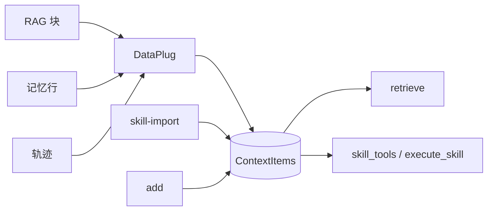

# DataPlug（数据源）

**DataPlug** 通过统一 API `ContextSeek.plug()` 把**外部数据源**导入 ContextSeek。导入后每条记录都是 `ContextItem`——按 `stage` 使用 `retrieve()`、`provenance` 与 `compact()` 等能力。

**`contextseek.plugs` 内置：**

| 数据源类型 | 类 | 典型 `stage` | 主要读取方式 |
|------------|-----|--------------|--------------|
| RAG / 检索 | `RAGPlug` | `raw` → 演进 | `retrieve()` |
| 记忆 | `PowerMemPlug` | `raw` → 演进 | `retrieve()` |
| 执行轨迹 | `TracePlug` | `raw` → 演进 | `retrieve()` |
| 技能 / 工具定义 | `HermesSkillImporter`、`MCPToolImporter`、`OpenAIFunctionImporter` | `skill` | `skill_tools()` / `execute_skill()` |

| 适用 | 不适用 |
|------|--------|
| RAG、记忆、轨迹、技能（`contextseek.plugs`） | Agent 框架 桥接（`bridges/langchain`、`bridges/deepagents`） |
| — | Harness 内逐轮对话适配 |

技能实现在 `plugs/skills/`，并从 `contextseek.plugs` 再导出。见 [技能导入](#技能导入-plugsskills)。

Agent 编排留在 Harness；**文档、记忆、轨迹、技能**用 plug 或 `add()` 写入。

---

## 协议

```python
from collections.abc import Iterator
from contextseek.protocols.plugs import DataPlug, PlugMeta, RawEvent

class MyWikiPlug:
    def metadata(self) -> PlugMeta:
        return PlugMeta(
            name="wiki_deploy",
            source_type="document",
            description="部署 Wiki 页面",
        )

    def stream(self) -> Iterator[RawEvent]:
        for page in crawl_wiki():
            yield RawEvent(
                content=page.text,
                source=f"wiki://{page.id}",
                tags=["wiki", "deploy"],
            )
```

| 类型 | 作用 |
|------|------|
| `PlugMeta` | `name`、`source_type` → `SourceType`、`description` |
| `RawEvent` | `content`、`source`、可选 `tags`、`metadata` |

`stream()` 应**惰性**产出；客户端对每条事件调用 `add()`。

---

## `plug()` 行为

```python
ctx.plug(source: DataPlug, *, scope: str | None = None)
```

每条事件：

1. **scope** = 参数 `scope`，或 `event.metadata["scope"]`，或 plug 的 `name`
2. 由 `event.source` 与 `PlugMeta.source_type` 构造 **provenance**
3. 可选从 `event.metadata` 读取 **stage** / **stability**
4. 与手动 `add()` 相同管线（摘要、嵌入、冲突检测）

```python
from contextseek import ContextSeek
from contextseek.plugs import RAGPlug

ctx = ContextSeek.from_settings()
scope = "acme/kb/imports"

ctx.plug(rag_plug, scope=scope)
hits = ctx.retrieve("回滚步骤", scope=scope, k=10)
```

---

## RAGPlug — 检索 / 知识块

把向量库、搜索 API 或 RAG 管道的 chunk 导入，进入演进路径（`raw` → `knowledge`），并支持 `feedback()`。

```python
from contextseek.plugs import RAGPlug

docs = vectorstore.similarity_search("部署检查清单", k=10)
payload = [
    {
        "page_content": d.page_content,
        "metadata": d.metadata,
        "score": 0.87,
        "source": d.metadata.get("url", "faiss"),
    }
    for d in docs
]

ctx.plug(RAGPlug(documents=payload), scope="acme/rag/deploy")
```

| 输入字段 | 映射 |
|----------|------|
| `content` 或 `page_content` | 正文 |
| `metadata` | 写入 provenance context |
| `score` | `metadata.retrieval_score` |
| `source` | provenance id（默认 plug 名） |

默认 tags：`rag`、`retrieval`。默认 `source_type`：`external_api`。

**工作流：** RAG 提供候选 → Agent 选用部分 → 对有用 id `feedback(+)` → 后续 `retrieve()` 更倾向这些条目。

---

## PowerMemPlug — 记忆库

从 [PowerMem](https://github.com/oceanbase/powermem) 或兼容 API 导入，不替换原系统，ContextSeek 作为统一召回层。

### 在线 store

```python
from contextseek.plugs import PowerMemPlug

plug = PowerMemPlug.from_memory(
    memory,
    user_id="user-42",
    agent_id="support-bot",
    limit=500,
)
ctx.plug(plug, scope="acme/bot/user-42")
```

### 导出 / 搜索结果

```python
rows = memory.search("billing", user_id="user-42")
plug = PowerMemPlug.from_records(rows, source_prefix="powermem")
ctx.plug(plug, scope="acme/bot/user-42")
```

| 行字段 | 映射 |
|--------|------|
| `content` 或 `memory` | 文本 |
| `id` | `source=powermem://{id}` |
| `metadata`、`importance`、`score` | 保留在 metadata |

示例：[examples/powermem_minimal.py](../../../../examples/powermem_minimal.py)、[examples/powermem_plug_demo.py](../../../../examples/powermem_plug_demo.py)。

导入后过滤：`retrieve(..., filters={"tags": ["powermem"]})`。

---

## TracePlug — 执行轨迹

批量导入 **执行轨迹**（Agent 运行、工具循环、作业日志），作为结构化 `raw` 供抽取与演进。

```python
from contextseek.plugs import TracePlug

ctx.plug(
    TracePlug(traces=[
        {
            "task_id": "deploy-42",
            "input": "将 service-x 部署到生产",
            "output": "失败：就绪探针超时",
            "tool_calls": [
                {"name": "kubectl_apply", "args": {"manifest": "prod.yaml"}, "result": "timeout"},
            ],
            "duration_ms": 183000,
            "status": "error",
            "tags": ["deploy", "prod"],
        },
    ]),
    scope="acme/ops/traces",
)
```

| 轨迹字段 | 写入 `content` |
|----------|----------------|
| `input`、`output` | 必填字符串 |
| `tool_calls` | 列表（默认 `[]`） |
| `task_id` | id + 默认 `source=trace_import://{task_id}` |
| `feedback`、`duration_ms`、`status` | 可选 |
| `tags` | 在 `trace` 之后追加 |
| `source` | 覆盖 provenance id |
| `metadata` | 嵌套 dict |

默认 `source_type`：`trace_extraction`。运行 `compact()` 提升到 `extracted` / `knowledge`（见 [上下文演进](../evolution.md)）。

单条轨迹也可用 `add(..., source_type=SourceType.trace_extraction)`，无需批量 plug。

---

## 技能导入（`plugs/skills`）

技能与工具定义写入 **`stage=skill`**，与 RAG/记忆/轨迹一样走 `plug()`。

```bash
contextseek skill-import --scope acme/bot/skills --format hermes --path ~/.hermes/skills
contextseek skill-import --scope acme/bot/skills --format openai --path tools.json
contextseek skill-import --scope acme/bot/skills --format mcp --path mcp-tools.json
```

```python
from contextseek.plugs import HermesSkillImporter

ctx.plug(HermesSkillImporter("~/.hermes/skills"), scope="acme/bot/skills")
```

（也可 `from contextseek.plugs.skills import …`。）

| Importer | 格式 |
|----------|------|
| `HermesSkillImporter` | `SKILL.md` / `*.skill.md` 目录树 |
| `OpenAIFunctionImporter` | OpenAI function / tool JSON |
| `MCPToolImporter` | MCP `tools/list` 载荷 |

导入后用 **`skill_tools()`**、**`skill_context()`**、**`execute_skill()`**（见 [MCP / HTTP / CLI](mcp-http-cli.md)）。也可由演进生成（`distill` → `stage=skill`）。

不提供 LangChain `BaseTool` 专用 Importer；请导出为 OpenAI/MCP JSON，或用 **bridges** 做运行时对接。

---

## 同一 scope 混合来源



```python
ctx.add("官方 SLA：4 小时", scope=scope, source="wiki/sla", tags=["kb"])
ctx.plug(PowerMemPlug.from_records(mem_rows), scope=scope)
ctx.plug(RAGPlug(documents=chunks), scope=scope)
# 技能：CLI skill-import 或 from contextseek.plugs import HermesSkillImporter

ctx.retrieve("SLA 与账单偏好", scope=scope, k=15)
ctx.skill_tools(scope=scope, query="部署检查清单")
```

按来源切片时用 `filters` 的 **tags** 或 **`stage`**。

---

## 自定义 plug 清单

1. `PlugMeta` 选对 `source_type`（`document`、`trace_extraction`、`external_api` 等）。
2. `event.source` 使用稳定 id（URL、主键、trace id）。
3. 生产导入对 `plug()` 传明确 `scope=`。
4. 大批量后跑 `overview(scope)`。

---

## 排错

| 现象 | 处理 |
|------|------|
| plug 后检索为空 | scope 不对；用 `items(scope)` 核对 |
| `ValueError` 重复 | 相同 content hash 已存在 |
| 行被跳过 | `content` / `memory` / 轨迹 `input`+`output` 为空 |
| 全是 `raw` | 正常；执行 `compact()` |

## 相关

- [写入与检索](../write-and-retrieve.md)
- [核心概念](../core-concepts.md)
- [MCP / HTTP / CLI](mcp-http-cli.md)
