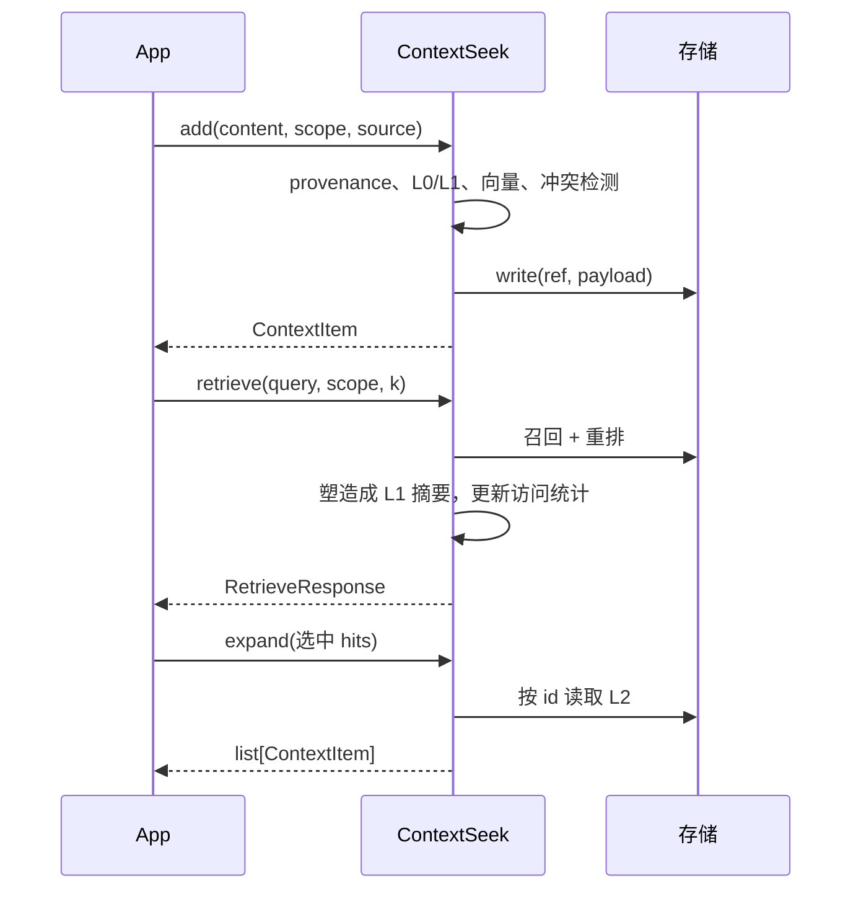

# 写入与检索

本文是 [核心概念](core-concepts.md) 的实操篇：逐项说明参数、检索管线、返回结构，以及在生产 Agent 中常用的模式。

## 总览

| 操作 | 方法 | 返回值 | 典型场景 |
|------|------|--------|----------|
| 写入 | `add()` | `ContextItem` | 用户输入、文档、Trace、工具结果 |
| 排名读取 | `retrieve()` | `RetrieveResponse` | 注入下一轮 Prompt |
| 升档 L2 | `expand()` | `list[ContextItem]` | 为选中命中加载全文 |
| 按 id 升档 | `expand_by_ids()` | `list[ContextItem]` | HTTP/MCP 无 `SearchHit` 时 |
| 枚举 | `items()` | `list[ContextItem]` | 运维、演进、调试（无相关性排序） |
| Agent 工具 | `tools()` | `list[ToolSpec]` | OpenAI / Anthropic 函数定义 |



---

## 使用 `add()` 写入

### 基本写入

```python
from contextseek import ContextSeek
from contextseek.domain.provenance import SourceType

ctx = ContextSeek.from_settings()

item = ctx.add(
    "回滚前必须先排空连接再执行 schema 变更。",
    scope="acme/payments/on-call",
    source="runbook/rollback-v4",
    source_type=SourceType.document,
    tags=["rollback", "mysql", "prod"],
)
print(item.id, item.stage, item.provenance.confidence)
```

### 参数说明

| 参数 | 必填 | 默认 | 说明 |
|------|------|------|------|
| `content` | 是 | — | `str` 或 `dict`（结构化 Trace/JSON） |
| `scope` | 是 | — | 隔离路径，如 `tenant/project/user-id` |
| `source` | 是 | — | 稳定来源 id：URL、trace id、文件路径等 |
| `source_type` | 否 | `human_input` | 入库方式；影响默认置信度与 stage 推断 |
| `tags` | 否 | `[]` | `retrieve()` 时须**同时包含**所列 tag |
| `confidence` | 否 | 按 source_type | 覆盖 provenance 置信度 `0.0`–`1.0` |
| `stage` | 否 | 自动推断 | 可强制 `raw` / `extracted` / `knowledge` / `skill` |
| `stability` | 否 | 随 stage | 生命周期策略 |
| `links` | 否 | `[]` | 与其他条目的 `Link` 关系 |
| `check_conflicts` | 否 | `True` | 写入时做重复/矛盾检测 |

### 结构化内容

```python
trace = ctx.add(
    {
        "input": "将 service-x 部署到 prod",
        "tool_calls": [{"name": "kubectl", "result": "timeout"}],
        "output": "部署失败：readiness 探针未通过",
    },
    scope="acme/platform/bot-7",
    source="session-trace-9f2a",
    source_type=SourceType.trace_extraction,
    tags=["deploy", "failure"],
)
```

展示或索引时用 `item.content_text`；`content` 为 dict 时按结构化存储。

### `add()` 内部步骤

1. **策略** — 可选写 ACL/脱敏（`SECURITY_*`）
2. **Provenance** — 由 `source` + `source_type` 构建
3. **Stage / stability** — 启发式或（开启时）LLM 分类
4. **冲突检测** — 完全重复抛 `ValueError`；近似重复打 `near_duplicate`；矛盾打 `has_contradiction` 并建 `refuted_by` 链接
5. **Summarizer** — 配置正确时生成 L0 `abstract`、L1 `summary`
6. **Embedder** — 对 L0（无则 L2 全文）做向量
7. **持久化** — 写入 `contextseek://{scope}/{id}`

无 summarizer/embedder 时，仍可通过 File 等后端的 **phrase/term** 子串召回检索。

### 重复与矛盾

```python
# 同 scope 内完全相同内容再次 add 会抛出：
# ValueError: exact duplicate exists: <existing_item_id>
```

仅在明确需要幂等重放时设 `check_conflicts=False`。矛盾默认**不阻断**写入，而是通过 tag/link 供检索与 `evidence_chain()` 使用。

---

## 使用 `retrieve()` 检索

### 基本用法

```python
response = ctx.retrieve(
    "回滚流程",
    scope="acme/payments/on-call",
    k=10,
)

print(response.meta.layer)   # "summary" 或 "full"
print(response.meta.hint)    # layer 为 summary 时提示 Agent 可调 expand

for hit in response:
    print(hit.score, hit.layer, hit.recall_path)
    print(hit.provenance_summary)
    print(hit.item.id, hit.item.stage.value)
    print(hit.item.summary or hit.item.content_text)
```

`RetrieveResponse` 可迭代：`for hit in response` 等价于遍历 `response.items`。

### 参数

| 参数 | 默认 | 说明 |
|------|------|------|
| `query` | 必填 | 自然语言或关键词，送入召回路由 |
| `scope` | 必填 | scope 前缀 |
| `k` | `10` | 重排后最多返回条数 |
| `full` | `False` | `True` 时在 `hit.item.content` 返回 L2 |
| `stage` | `None` | 按 Stage 过滤 |
| `tags` | `None` | 条目须包含**全部**指定 tag |
| `filters` | `None` | 可含 `stage`、`tags`、`min_confidence` |
| `include_deleted` | `False` | 是否包含软删除条目 |

### `filters` 字典

```python
response = ctx.retrieve(
    "数据库",
    scope="acme/db/eng",
    k=20,
    filters={
        "stage": "knowledge",
        "tags": ["mysql"],
        "min_confidence": 0.7,
    },
)
```

显式 `stage`/`tags` 与 `filters` 同时存在时，以显式参数为准。

### 检索管线

1. **解析前缀** — `scope` → 存储路径前缀  
2. **多路召回** — `RETRIEVAL_RECALL_ROUTES`：  
   - `phrase`：整句查询  
   - `terms`：分词（支持中文等 Unicode 词符）  
   - `vector`：向量相似度（需 embedder + 向量后端）  
3. **合并去重** — 按 item id 合并  
4. **重排** — `heuristic` 或 `llm`  
5. **读策略过滤** — ACL  
6. **塑形** — 默认去掉有 summary 的 hit 的 L2，标 `layer="summary"`  
7. **访问统计** — 命中条目 `touch()`  

**File 后端**：子串匹配，查询宜用短关键词（如 `"回滚"`、`"向量"`），不宜用过长口语问句。

### `SearchHit` 字段

| 字段 | 含义 |
|------|------|
| `item` | `ContextItem`；默认看 `summary`，`full=True` 或 `expand` 后有 `content` |
| `score` | 重排后综合相关分 |
| `layer` | `"summary"` 或 `"full"` |
| `provenance_summary` | 来源一行描述 |
| `stage_confidence` | 由 stage 推导的可信度先验 |
| `recall_path` | 命中来自哪条召回路（调试） |

### `ResponseMeta`

| 字段 | 含义 |
|------|------|
| `layer` | 仅当**全部** hit 为 summary 时为 `"summary"` |
| `full_via` | 固定 `"expand"` |
| `hint` | 给弱模型的自然语言提示，建议对摘要不足的 id 调 expand |

未配置 summarizer 且 `full=False` 时可能只有 L2，并**一次性** `warnings.warn`。

---

## `full=True` 与 `expand()`

| 方式 | Token 成本 | 适用 |
|------|------------|------|
| 默认 `retrieve()` | 低（L1） | 大多数对话轮次 |
| `full=True` | 高（top‑k 全 L2） | `k` 很小且总要全文 |
| `retrieve` + `expand(子集)` | 中 | **推荐** Agent 方案 |

```python
response = ctx.retrieve("事故手册", scope="acme/sre/team", k=15)
candidates = [h for h in response if h.score >= 0.55][:3]
full_items = ctx.expand(candidates)
```

`expand()` 用 `hit.item.scope` 与 `hit.item.id` 读存储，**无需**再传 scope。

### `expand_by_ids()`

```python
full_items = ctx.expand_by_ids(["abc123", "def456"], scope="acme/sre/team")
```

---

## `items()` 与 `retrieve()` 的区别

| | `items(scope, stage=…)` | `retrieve(query, scope, k=…)` |
|--|-------------------------|--------------------------------|
| 排序 | `created_at` 升序 | 相关分降序 |
| 查询 | 无，列举前缀下全部 | 必须有 query |
| 场景 | compact、审计、全量列举 | Prompt 注入、RAG |

勿用 `items()` 拼大规模 Prompt；用带 query 的 `retrieve()`。

---

## 向 LLM 暴露 `tools()`

```python
for spec in ctx.tools():
    print(spec.to_openai())
```

| 工具名 | 作用 |
|--------|------|
| `retrieve` | `query`、`scope`、可选 `k`、`full` |
| `expand` | `ids`、`scope` → L2 |

典型两轮：先 `retrieve` 拿摘要与 id → 再对 1–3 个 id `expand`。

---

## 完整示例：客服一轮对话

```python
from contextseek import ContextSeek

ctx = ContextSeek.from_settings()
scope = "acme/support/user-8812"

ctx.add("用户等级：企业版；SLA 4 小时。", scope=scope, source="crm/profile", tags=["profile"])
ctx.add(
    "错误 E4021：支付网关 30s 超时，请用幂等键重试。",
    scope=scope,
    source="kb/payments",
    tags=["kb", "payments"],
)

response = ctx.retrieve("结账为什么超时", scope=scope, k=8)
lines, expand_ids = [], []
for hit in response:
    lines.append(f"- [{hit.score:.2f}] {hit.item.summary or hit.item.content_text[:300]}")
    if hit.score > 0.5:
        expand_ids.append(hit.item.id)

if expand_ids:
    for item in ctx.expand_by_ids(expand_ids[:2], scope=scope):
        lines.append(f"\n[全文] {item.content_text[:1500]}")

system_prompt = "相关上下文：\n" + "\n".join(lines)
```

---

## 运维建议

### 调召回

```env
RETRIEVAL_RECALL_ROUTES=["phrase","terms","vector"]
RETRIEVAL_RERANKER_MODE=llm
```

File 后端先从 `["phrase","terms"]` 开始；接 OceanBase 等再加 `vector`。

### Scope 划分

- 默认：**终端用户 × 产品** 一个 scope。  
- 团队知识：用团队 scope，勿按用户复制多份。  
- 跨 scope 检索需多次 `retrieve()` 或经 DataPlug 汇聚。

### 反馈

```python
ref = ctx.resolver.ref_for(scope, hit.item.id)
ctx.feedback(ref, scope=scope, score=0.3, reason="用于解决工单")
```

### 检索为空时排查

1. `ctx.items(scope=scope)` 是否有数据  
2. 缩短 query，确保能**子串命中** content（File）  
3. 检查 tags 是否过严（须全部匹配）  
4. 检查 `stage` 过滤  
5. 看部分结果的 `recall_path`  

---

## 相关文档

- [配置](../getting-started/configuration.md)
- [核心概念](core-concepts.md)
- [溯源与审计](provenance-and-audit.md)
- [存储后端](storage.md)
